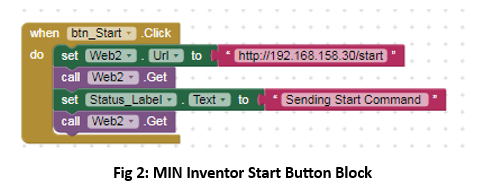
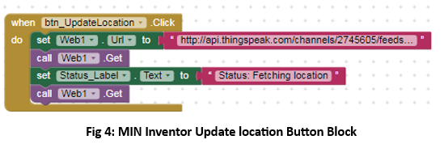
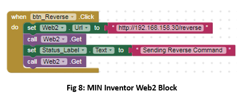
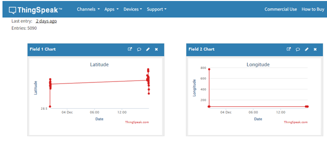

<h1 align="center">MIT APP INVENTOR DESIGN AND CODE</h1>

	
<h3>App Layout</h3>

Buttons:

	<ul>
		<li>Start: Sends the "START" command to the ESP32 web server.</li>
		<li>Stop: Sends the "STOP" command to the ESP32 web server.</li>
		<li>Update Location: Fetches location from ThingSpeak.</li>
		<li>Show Location: Displays the location on Google Maps using a WebViewer.</li>
		<li>Refresh: Resets the app to its initial state.</li>
	</ul>

Web Components:
<ul>
	<li>Web1: Fetches GPS data from ThingSpeak.</li>
	<li>Web2: Sends "START" and "STOP" commands to the ESP32.</li>
	
</ul>

Designer View

  

Fig 1: MIN Inventor Designer Window

<h3>App Blocks Explanation</h3>

Start Button:

Sets Web2 URL to /start and triggers the ESP32 server to start the car.

  

Stop Button:

Sets Web2 URL to /stop and triggers the ESP32 server to stop the car.

  

Update Location Button:

Fetches latitude and longitude from ThingSpeak using Web1.

  

View Location on Google map Button:

Loads Google Maps URL in WebViewer with the latest coordinates.

  

Web1 Code: Fetches GPS data from ThingSpeak.

  

Web2 Code: Sends "START" and "STOP" commands to the ESP32

  

Reverse Button Commands

  

<h2 align="center">OUTPUT AND RESULT</h2>

  

Fig 9- ThingSpeak Output

  

